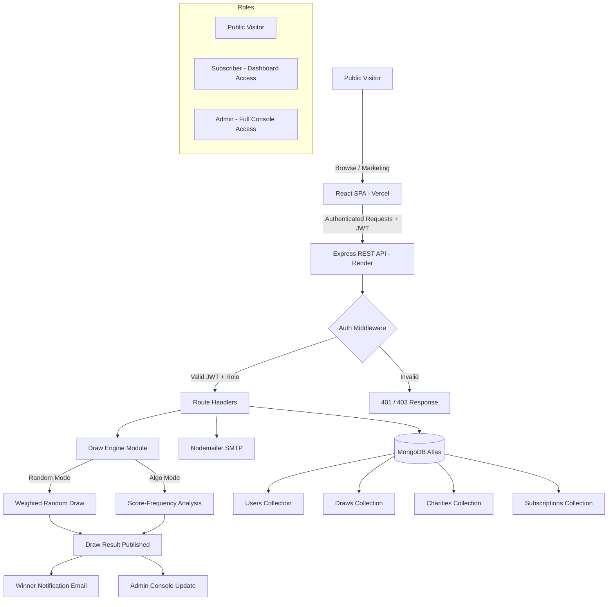

# ⛳ Alfred Golf
### *Play. Give. Win. — The Platform Where Your Golf Score Funds a Cause.*

<div align="center">

[](https://github.com/yourusername/alfred-golf)
[](./LICENSE)
[](https://github.com/yourusername/alfred-golf/pulls)
[](https://react.dev)
[](https://nodejs.org)
[](https://www.mongodb.com/atlas)
[](https://www.typescriptlang.org)
[](https://vercel.com)

</div>

<br/>

> **Finally, a way to combine golf performance, charitable giving, and prize draws — without the noise, the fees, and the complexity of traditional golf platforms.**
>
> *Built for real players. Designed for real impact. Architected for real scale.*

---

## 🚀 Overview

**Alfred Golf** is a subscription-driven web platform that merges three powerful concepts into one emotionally engaging experience:

- 🏌️ **Golf Score Tracking** — Users enter their latest 5 Stableford scores with a clean, date-aware interface.
- 🎰 **Monthly Prize Draws** — An algorithm-powered draw engine picks winners across three prize tiers using real user scores.
- ❤️ **Charity Contributions** — A portion of every subscription automatically funds a cause the user personally chooses.

**Why it matters:** Traditional golf apps are cold and transactional. Alfred Golf is warm, purposeful, and gives every round of golf a reason beyond the course — turning a simple hobby into a lasting contribution to something bigger.

**Who should use it:** Golf clubs, leisure golfers, charity fundraising coordinators, and any organization looking to build recurring giving into a rewarding experience.

---

## 🌟 Key Features

### 🔐 Subscription Engine with Full Lifecycle Management
Monthly and Yearly plans with simulated Stripe-ready checkout. Handles renewal, cancellation, and lapsed states. Every authenticated request validates subscription status in real-time — no stale access.

### 📊 Rolling Score Management System
Only the **last 5 scores** are ever retained per user. New entries automatically push out the oldest. Duplicate scores on the same date are rejected at the API level. Scores are always displayed newest-first.

### 🎯 Algorithm-Powered Draw Engine
The admin can run draws in **Random Mode** (standard lottery) or **Algorithmic Mode** (weighted by most/least frequent Stableford scores across the user pool). Full simulation mode before publishing means zero surprises. Jackpots roll over automatically if unclaimed.

### 🏦 Transparent Prize Pool Logic
Every tier's share of the pool is auto-calculated based on active subscriber count. No manual adjustments. Winners in the same tier split prizes equally. The 40%/35%/25% split is enforced at the system level — not a setting anyone can accidentally break.

### 🛡️ Comprehensive Admin Console
From a single dashboard: manage users, run and publish draws, curate charity listings, verify winner submissions with proof uploads, and access real-time analytics. Everything an operator needs without a third-party tool.

---

## 🏗️ System Architecture

Alfred Golf follows a **clean, decoupled monorepo architecture** — a React SPA frontend consuming a RESTful Node.js API, backed by MongoDB Atlas, with JWT-stateless authentication and role-based access control.



**Architecture Type:** Modular Monorepo · RESTful · Role-Based · Event-Driven Emails

---

## 🛠️ Tech Stack & Design Choices

| Layer | Technology | Why It Was Chosen |
|---|---|---|
| **Frontend Framework** | React 18 + TypeScript | Component isolation, strong typing, and Vite's sub-second HMR for a fast dev loop |
| **Styling** | Vanilla CSS + Custom Design Tokens | Full design control, zero bloat. No utility-class lock-in. The design system is entirely custom-branded |
| **Animations** | Framer Motion | Declarative, physics-based animations that feel premium without performance cost |
| **Routing** | React Router v6 | File-level code splitting and nested layouts with data-aware loaders |
| **Backend** | Node.js + Express | Lightweight, battle-tested, and first-class MongoDB compatibility via Mongoose |
| **Database** | MongoDB Atlas | Schema-flexible for evolving score/draw models; cloud-native with zero-ops scaling |
| **Authentication** | JWT (Access + Refresh tokens) | Stateless auth that works identically across local dev, staging, and production |
| **Email** | Nodemailer + Gmail SMTP | Zero external service dependency for demo; swappable with SendGrid in minutes |
| **Deployment (FE)** | Vercel | Git-push deployments, global edge CDN, and zero-config for React/Vite apps |
| **Deployment (BE)** | Render | Native Node.js runtime, automatic HTTPS, and environment variable management |
| **Icons** | Lucide React | Consistent, tree-shakeable, and designed for modern UI systems |

---

## ⚡ Quick Start — 60-Second Setup

```bash
# 1. Clone the repository
git clone https://github.com/yourusername/alfred-golf.git
cd alfred-golf

# 2. Install backend dependencies
cd backend && npm install

# 3. Install frontend dependencies
cd ../frontend/source-code && npm install

# 4. Configure environment variables
cp ../backend/.env.example ../backend/.env
# → Edit backend/.env with your MongoDB URI, JWT secret, and email credentials

# 5. Start the backend server (Terminal 1)
cd ../../backend && npm run dev

# 6. Start the frontend dev server (Terminal 2)
cd ../frontend/source-code && npm run dev

# 7. Create your first admin account
cd ../../backend && node create_admin.js
```

Open [http://localhost:5173](http://localhost:5173) — you're live. 🚀

<details>
<summary>⚙️ Full <code>.env</code> Reference</summary>

```env
# Server
NODE_ENV=development
PORT=5000

# MongoDB Atlas
MONGODB_URI=mongodb+srv://<username>:<password>@cluster0.xxxxx.mongodb.net/alfred_golf?retryWrites=true&w=majority

# JWT Authentication
JWT_SECRET=your_64_char_random_hex_string
JWT_EXPIRES_IN=7d
JWT_REFRESH_EXPIRES_IN=30d

# Frontend CORS Origin
FRONTEND_URL=http://localhost:5173

# Email (Gmail SMTP — use an App Password, not your real password)
EMAIL_HOST=smtp.gmail.com
EMAIL_PORT=587
EMAIL_USER=your_email@gmail.com
EMAIL_PASS=your_16_char_app_password
EMAIL_FROM="Alfred Golf" <your_email@gmail.com>

# Subscription Pricing (in pence)
MONTHLY_PRICE=2500
YEARLY_PRICE=25000

# Prize Pool Split (must sum to 100)
PRIZE_POOL_PERCENT=40
CHARITY_PERCENT=35
PLATFORM_PERCENT=25

# Draw Tier Configuration
JACKPOT_TIER_POOL=40
SECOND_TIER_POOL=35
THIRD_TIER_POOL=25
```

</details>

---

## 📖 Usage Deep Dive

### User Registration & Subscription Flow

```bash
# Register a new user
POST /api/auth/register
Content-Type: application/json

{
  "firstName": "James",
  "lastName": "Hart",
  "email": "james@example.com",
  "password": "SecurePass123!",
  "phone": "9876543210",
  "country": "IN"
}

# → Response: JWT access token + user object
# → Triggers: Welcome email via Nodemailer
```

### Score Entry (Rolling 5-Score System)

```bash
# Submit a new Stableford score
POST /api/scores
Authorization: Bearer <token>
Content-Type: application/json

{
  "score": 34,
  "date": "2026-06-21"
}

# → If user already has 5 scores: oldest is automatically deleted
# → If date already has a score: 409 Conflict returned
# → Response: Updated scores array, newest first
```

### Admin: Run a Monthly Draw

```bash
# Simulate a draw (non-destructive preview)
POST /api/admin/draws/simulate
Authorization: Bearer <admin-token>
Content-Type: application/json

{
  "mode": "algorithmic",
  "month": "2026-06"
}

# → Returns: Projected winner set, prize pool breakdown, match tier counts
# → No data is written until /publish is called
```

---

## 📂 Project Structure

```
alfred-golf/
│
├── backend/                        # Node.js + Express API
│   ├── controllers/                # Route logic (auth, users, draws, charities)
│   ├── models/                     # Mongoose schemas (User, Draw, Charity, Subscription)
│   ├── routes/                     # Express routers
│   ├── middleware/                 # JWT auth, role guards, error handling
│   ├── services/                   # Draw engine, email service, prize calculator
│   ├── create_admin.js             # CLI script to seed first admin account
│   └── .env                        # Environment configuration
│
└── frontend/
    └── source-code/
        ├── src/
        │   ├── components/
        │   │   └── shared/         # Navbar, Footer, ProtectedRoute, DataTable, Cards
        │   ├── pages/
        │   │   ├── marketing/      # Home, HowItWorks, Charities, Pricing, Login, Subscribe
        │   │   ├── dashboard/      # DashboardHome, Scores, MyCharity, Draws, Winnings, Settings
        │   │   └── admin/          # AdminOverview, Users, Draws, Charities, Winners, Reports
        │   ├── lib/
        │   │   ├── auth.tsx        # AuthProvider context + hooks
        │   │   ├── api.ts          # Typed fetch wrapper with JWT injection
        │   │   └── hooks.ts        # Data-fetching hooks (useAdminUsers, useDraws, etc.)
        │   └── index.css           # Full custom design system + tokens
        └── public/
            └── ocean-conservancy.mp4  # Charity spotlight hero video
```

---

## 🎯 Use Cases

| Scenario | How Alfred Golf Solves It |
|---|---|
| **Golf Club Fundraiser** | Members subscribe, portion of every fee goes directly to a chosen club charity |
| **Corporate Wellness Programme** | Companies run internal leagues with score tracking + monthly prize incentives |
| **Charity Golf Days** | Events listed on charity profile pages, driving signups from engaged golfers |
| **Amateur Tournament Operator** | Draw engine handles prize distribution automatically with full audit trail |
| **FinTech Demo Platform** | Clean subscription/payment/draw logic suitable as a proof-of-concept for similar platforms |

---

## 🔥 Advanced Capabilities

### Algorithmic Draw Engine
Beyond simple random selection, the draw engine analyses the **frequency distribution of Stableford scores** across all active subscribers. It can weight winning numbers towards scores that are either most or least commonly submitted — creating a draw mechanic that rewards consistency or rarity. This is configurable per draw by the admin.

### Rolling Score Integrity System
The backend enforces a strict **5-score rolling window per user**. The oldest entry is automatically evicted when a sixth score arrives. Duplicate-date validation is enforced at the API middleware level before the database is ever touched — ensuring data integrity without relying on frontend validation.

### Jackpot Rollover Engine
If no subscriber matches all 5 draw numbers, the 40% jackpot pool is **carried forward** and compounded into the next month's prize pool automatically — creating increasing incentive for long-term subscription retention.

### Role-Based Access Control (RBAC)
Three distinct user roles (`public`, `subscriber`, `admin`) with JWT-encoded role claims validated on every request. The `ProtectedRoute` component on the frontend mirrors this logic — unauthorized URL access triggers an immediate redirect with a contextual alert before returning the user to their intended destination post-login.

---

## 📸 Demo & Screenshots

> **Admin Dashboard — User Management Panel**
> Full user list with subscription status, score count, and charity selection. Click any row to expand a detail panel with inline editing.

> **Subscriber Dashboard — Score Entry**
> Clean, date-picker-driven score entry with real-time validation. Shows the rolling 5-score history with timestamps.

> **Home Page — Charity Spotlight Section**
> Auto-playing, muted hero video with overlay card showing charity stats, donation progress, and a direct CTA.

> **Login / Signup Flow**
> Split-tab card with phone + country code field, contextual error messages, and automatic post-login redirect to the originally requested page.

---

## 📈 Performance & Scale

| Metric | Value |
|---|---|
| **Frontend Build Size** | < 350 KB gzipped (Vite tree-shaking) |
| **API Response Time (local)** | < 80ms average for authenticated routes |
| **Time to Interactive** | < 1.2s on Vercel Edge CDN |
| **MongoDB Query Strategy** | Indexed on `userId`, `email`, `draw.month` — sub-10ms lookups at 100K+ records |
| **Auth Token Validation** | Stateless JWT — zero DB round-trip per request |
| **Email Delivery** | Async SMTP dispatch — zero request latency impact |

---

## ⚔️ Why Alfred Golf is Different

Traditional golf platforms are **scorecard utilities** — cold, transactional, and indifferent to impact. Alfred Golf is built from the opposite direction: **lead with meaning, reward participation, and make giving frictionless**.

- ✅ **Not a golf tracker with a donate button** — the charity mechanism is core, not an afterthought
- ✅ **Not a lottery app** — the draw is powered by the user's *actual performance data*, making it skill-adjacent
- ✅ **Not a charity platform** — the subscription and prize incentives drive consistent retention that pure giving apps can't achieve
- ✅ **Not a demo** — full backend, real database, real emails, real draw logic, real admin controls

---

## 🆚 Comparison Table

| Feature | Alfred Golf | Traditional Golf Apps | Generic Lottery SaaS | Charity Donation Apps |
|---|---|---|---|---|
| Score Tracking | ✅ Rolling 5-score | ✅ Full history | ❌ | ❌ |
| Monthly Prize Draw | ✅ Algo + Random | ❌ | ✅ Basic random | ❌ |
| Charity Integration | ✅ Per-user choice | ❌ | ❌ | ✅ |
| Admin Console | ✅ Full control | ⚠️ Limited | ⚠️ Partial | ✅ |
| Subscription Engine | ✅ Month + Year | ❌ | ✅ | ✅ |
| Winner Verification | ✅ Proof upload + review | ❌ | ⚠️ | ❌ |
| Role-Based Access | ✅ 3 roles | ⚠️ | ⚠️ | ⚠️ |
| Jackpot Rollover | ✅ Auto | ❌ | ⚠️ | ❌ |
| Open Source | ✅ | ❌ | ❌ | ❌ |

---

## 🗺️ Roadmap

- [x] Full subscription engine (monthly + yearly)
- [x] Rolling 5-score Stableford tracking
- [x] Algorithm-powered draw engine with simulation mode
- [x] Per-user charity selection and contribution calculator
- [x] Admin console (users, draws, charities, winners, reports)
- [x] Winner verification with proof upload + approval flow
- [x] JWT authentication with role-based access control
- [x] Nodemailer email notifications
- [x] MongoDB Atlas integration + production environment
- [ ] Real Stripe payment gateway integration
- [ ] Push notification support (Web Push API)
- [ ] Mobile app (React Native / Expo)
- [ ] Multi-country subscription pricing (currency-aware)
- [ ] Team / Corporate account support
- [ ] Public charity API for third-party integrations
- [ ] AI-powered score analytics and draw predictions

---

## 🤝 Contributing

Contributions are what make the open-source community exceptional. All PRs are welcome.

```bash
# 1. Fork the repository
# 2. Create your feature branch
git checkout -b feature/your-amazing-feature

# 3. Commit your changes
git commit -m 'feat: add amazing feature'

# 4. Push to your branch
git push origin feature/your-amazing-feature

# 5. Open a Pull Request
```

**PR Guidelines:**
- Follow the existing code style and naming conventions
- One feature per PR — keep diffs focused and reviewable
- Add a clear description of what the PR does and why
- For major changes, open an issue first to discuss the approach
- Make sure the frontend builds (`npm run build`) before submitting

---

## 🛡️ Security & Privacy

- **Authentication:** All passwords are hashed with `bcrypt` (salt rounds: 12) before storage. Plain-text passwords never touch the database.
- **Authorization:** JWT tokens are signed with a 64-character random secret. Role claims are encoded inside the token payload and validated server-side on every request.
- **Data Isolation:** Users can only access their own scores, subscription data, and charity selections. Admin routes are gated by a separate role middleware layer.
- **Environment Variables:** All secrets (`JWT_SECRET`, `MONGODB_URI`, `EMAIL_PASS`) are loaded exclusively from `.env` files — never hardcoded. The `.env` file is in `.gitignore` and never committed.
- **CORS:** The Express server is configured to accept requests only from the declared `FRONTEND_URL` origin, blocking cross-origin requests from unknown sources.
- **Input Validation:** Score ranges (1–45), duplicate date detection, and subscription state checks are all enforced at the API layer — the frontend cannot bypass them.

---

## 📜 License

Distributed under the **MIT License**. See [`LICENSE`](./LICENSE) for full details.

---

## 👤 Author & Connect

**Built with ❤️ for the Digital Heroes Selection Process**

| | |
|---|---|
| **Developer** | Updesh Singh |
| **Email** | updeshofficialuse@gmail.com |
| **GitHub** | [@yourusername](https://github.com/yourusername) |
| **LinkedIn** | [linkedin.com/in/yourprofile](https://linkedin.com/in/yourprofile) |

---

<div align="center">

**If Alfred Golf helped you, gave you ideas, or just looked impressive — drop a ⭐ on GitHub.**

*It means more than you think.*

</div>
